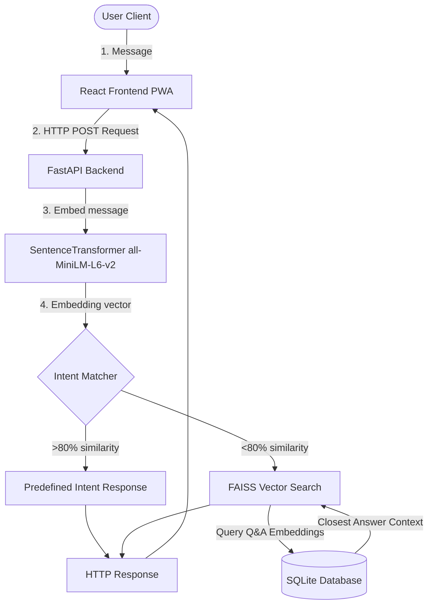

# AI-Powered Chatbot Platform (ChatGPT Style)

A modern, production-ready, highly optimized AI chatbot platform designed for low-resource cloud servers (e.g. Azure Student Free Tier VM: 2 vCPU, 1 GB RAM, Ubuntu). It utilizes a hybrid AI retrieval approach combining **Intent Classification** (via Cosine Similarity) and **Dense FAQ Search** (via FAISS Vector Store).

---

## System Architecture



### Hybrid Matching Flow
1. **User Message Ingestion**: The student inputs a message.
2. **Intent Classification**: The message is encoded using `all-MiniLM-L6-v2`. We compute the cosine similarity against all example patterns in the intents catalog (`intents.json`). If the similarity of the closest matching pattern exceeds **80%**, the platform immediately returns the corresponding pre-selected template response (avoiding database operations).
3. **FAISS FAQ Retrieval**: If intent matching confidence is below **80%**, the query is passed to a **FAISS** vector store, searching the indexed `question` embeddings of the `KnowledgeBase` database table. The best semantic match answer (above 40% similarity) is returned.
4. **Fallback**: If no matches are found, the chatbot gracefully returns a support email redirect.
5. **PDF Ingestion**: Administrators can upload PDF files. The text is chunked into sliding windows, sentences are extracted to serve as searchable retrieval keys in the `KnowledgeBase` table, and the FAISS index is instantly rebuilt in memory.

---

## Folder Structure

```
AI-Chatbot/
├── backend/
│   ├── app/
│   │   ├── api/
│   │   │   ├── __init__.py
│   │   │   ├── analytics.py
│   │   │   ├── auth.py
│   │   │   ├── chat.py
│   │   │   ├── feedback.py
│   │   │   └── kb.py
│   │   ├── core/
│   │   │   ├── config.py
│   │   │   ├── database.py
│   │   │   ├── security.py
│   │   │   └── seeding.py
│   │   ├── models/
│   │   │   └── database.py
│   │   ├── schemas/
│   │   │   ├── auth.py
│   │   │   ├── chat.py
│   │   │   ├── feedback.py
│   │   │   └── kb.py
│   │   ├── services/
│   │   │   └── ai_service.py
│   │   ├── __init__.py
│   │   └── main.py
│   ├── data/
│   │   ├── chatbot.db (Auto-created)
│   │   └── intents.json
│   └── requirements.txt
├── frontend/
│   ├── public/
│   │   ├── favicon.ico
│   │   ├── manifest.json
│   │   └── sw.js
│   ├── src/
│   │   ├── components/
│   │   │   ├── Chat/
│   │   │   │   ├── ChatArea.tsx
│   │   │   │   ├── ChatBubble.tsx
│   │   │   │   ├── InputBar.tsx
│   │   │   │   ├── Sidebar.tsx
│   │   │   │   └── SuggestedPrompts.tsx
│   │   │   └── Settings/
│   │   │       └── SettingsModal.tsx
│   │   ├── context/
│   │   │   └── AuthContext.tsx
│   │   ├── pages/
│   │   │   ├── AdminPage.tsx
│   │   │   ├── ChatPage.tsx
│   │   │   ├── LoginPage.tsx
│   │   │   └── RegisterPage.tsx
│   │   ├── services/
│   │   │   └── api.ts
│   │   ├── App.tsx
│   │   ├── index.css
│   │   └── main.tsx
│   ├── index.html
│   ├── package.json
│   ├── postcss.config.js
│   ├── tailwind.config.js
│   └── vite.config.ts
├── deployment/
│   ├── chatbot.service
│   ├── deploy.sh
│   └── nginx.conf
└── README.md
```

---

## Database Design (SQLite)

We use SQLAlchemy Object-Relational Mapping (ORM) to define and interact with SQLite tables:

### Users Table (`users`)
- `id` (INTEGER, Primary Key, Index)
- `name` (VARCHAR, Nullable=False)
- `email` (VARCHAR, Unique, Index, Nullable=False)
- `password_hash` (VARCHAR, Nullable=False)
- `role` (VARCHAR, Default="user"): Admin or User access level
- `created_at` (DATETIME, Default=UTC_NOW)

### Chats Table (`chats`)
- `id` (INTEGER, Primary Key, Index)
- `user_id` (INTEGER, ForeignKey("users.id", CASCADE))
- `title` (VARCHAR, Default="New Chat")
- `created_at` (DATETIME, Default=UTC_NOW)

### Messages Table (`messages`)
- `id` (INTEGER, Primary Key, Index)
- `chat_id` (INTEGER, ForeignKey("chats.id", CASCADE))
- `sender` (VARCHAR): "user" or "bot"
- `message` (TEXT, Nullable=False)
- `timestamp` (DATETIME, Default=UTC_NOW)

### KnowledgeBase Table (`knowledge_base`)
- `id` (INTEGER, Primary Key, Index)
- `category` (VARCHAR): Group (e.g. Admission, Fees, Hostel)
- `question` (TEXT): Search query string matching key
- `answer` (TEXT): Detailed response text

### Feedback Table (`feedbacks`)
- `id` (INTEGER, Primary Key, Index)
- `user_id` (INTEGER, ForeignKey("users.id", SET_NULL))
- `chat_id` (INTEGER, ForeignKey("chats.id", CASCADE))
- `rating` (INTEGER): Star count rating (1 to 5)
- `comment` (TEXT, Nullable=True)
- `created_at` (DATETIME, Default=UTC_NOW)

---

## API Endpoints Spec Sheet

| Method | Endpoint | Access | Description |
| :--- | :--- | :--- | :--- |
| **POST** | `/api/auth/register` | Public | Register student credentials |
| **POST** | `/api/auth/login` | Public | Validate logins and return JWT token |
| **GET** | `/api/auth/me` | User | Get current session user details |
| **GET** | `/api/chats` | User | Fetch active chats list (query `?search=` filters title) |
| **POST** | `/api/chats/message` | User | Send user message, trigger AI classification & reply |
| **GET** | `/api/chats/{id}` | User | Retrieve full message thread logs |
| **DELETE**| `/api/chats/{id}` | User | Delete chat session channel |
| **GET** | `/api/chats/{id}/export`| User | Download transcript as formatted `.txt` |
| **GET** | `/api/kb` | User | Get all Knowledge Base records |
| **POST** | `/api/kb` | Admin | Manually insert a FAQ, triggers FAISS refresh |
| **POST** | `/api/kb/upload` | Admin | Ingest a PDF document, chunk text, and rebuild index |
| **DELETE**| `/api/kb/{id}` | Admin | Delete FAQ, rebuild FAISS index |
| **POST** | `/api/feedback` | User | Log chat review rating (1-5) and text comment |
| **GET** | `/api/feedback` | Admin | Retrieve all feedback reviews list |
| **GET** | `/api/analytics/stats` | Admin | Aggregated counters and rating charts |

---

## PWA Capabilities
- **Service Worker (`sw.js`)**: Caches essential React bundles, icon stylesheets, and documents. Uses a Cache-first strategy fallback for offline page refreshes.
- **Manifest (`manifest.json`)**: Configures display parameters to allow installing the chatbot onto device Home screens, supporting full fullscreen standalone window modes.

---

## Commands to Run Locally

### 1. Run Backend Server
Inside the `/backend` folder:
```bash
# Create Python virtual environment
python -m venv venv

# Activate virtual environment
# On Windows:
.\venv\Scripts\activate
# On Linux/macOS:
source venv/bin/activate

# Install requirements
pip install -r requirements.txt

# Initialize database schema and seed default FAQs
python -c "from app.core.seeding import seed_database; seed_database()"

# Run FastAPI with reload hot-swapping
uvicorn app.main:app --host 127.0.0.1 --port 8000 --reload
```

### 2. Run Frontend Server
Inside the `/frontend` folder:
```bash
# Install node packages
npm install

# Run Vite dev server (serves on http://localhost:5173)
npm run dev
```

---

## Commands to Deploy on Azure VM (Ubuntu Server)

Connect to your Ubuntu VM via SSH:
```bash
# 1. Clone your project repository onto the VM
git clone <repository_url> chatbot-platform
cd chatbot-platform

# 2. Make the deployment script executable
chmod +x deployment/deploy.sh

# 3. Run the deployment script
# (Installs python-venv, nginx, nodejs, builds frontend, installs CPU-only torch, starts system service)
sudo ./deployment/deploy.sh
```

### Checking Services Health
Once the deployment finishes:
- View Nginx status: `sudo systemctl status nginx`
- View backend logs: `sudo journalctl -u chatbot.service -f`
- Confirm Swagger documentation is reachable at `http://<your_vm_ip>/docs`

---

## Hosting & Architecture Setup Guide

### 1. Frontend Hosting on Cloudflare Pages (Coexisting with other subfolders)
Since your repository (`codealpha_tasks`) has multiple subfolders (such as `bus_pass_system` and `AI-Chatbot`), you can configure Cloudflare Pages to build **only** the AI-Chatbot frontend and host it under a separate domain/subdomain:

1. **Log in** to your Cloudflare Dashboard.
2. Navigate to **Workers & Pages** -> **Pages** -> **Create a project** -> **Connect to Git**.
3. Select your `codealpha_tasks` repository.
4. Set up the build configuration:
   - **Project Name**: Enter a custom name (e.g., `codealpha-ai-chatbot`). This ensures it maps to `codealpha-ai-chatbot.pages.dev` instead of conflicting with your other pages like `codealpha_tasks.pages.dev`.
   - **Production Branch**: `main` (or your primary branch).
   - **Root Directory**: `AI-Chatbot/frontend` (This is critical! It tells Cloudflare to build only the chatbot frontend folder).
   - **Framework Preset**: `Vite`.
   - **Build Command**: `npm run build`.
   - **Build Output Directory**: `dist`.
5. Click **Save and Deploy**. Cloudflare will deploy your chatbot frontend separately.

### 2. Running Co-located on the Same Azure VM
You can run this chatbot backend alongside the `bus-pass-system` backend on the same Azure VM. Here is how they coexist without port conflicts:

* **Configure Ports**:
  Ensure the chatbot service runs on a different port than the bus-pass-system (e.g., if the bus-pass-system uses port `8000`, run the chatbot on port `8001` or vice versa).
  In [chatbot.service](file:///c:/Users/Rishabh%20Kankariya/Desktop/codealpha_tasks/AI-Chatbot/deployment/chatbot.service#L12), change:
  ```ini
  ExecStart=/var/www/chatbot/backend/venv/bin/uvicorn app.main:app --host 127.0.0.1 --port 8001 --workers 2
  ```

* **Configure Nginx Routing**:
  You can route requests to the different backends using subdomains or distinct location blocks:
  * **Option A: Using Subdomains (Recommended)**
    Map a subdomain like `chatbot-api.yourdomain.com` to port `8001` and `bus-api.yourdomain.com` to port `8000`.
  * **Option B: Using Location Paths**
    Route `/api` or `/bus-api` to port `8000`, and `/chatbot-api` to port `8001`.
